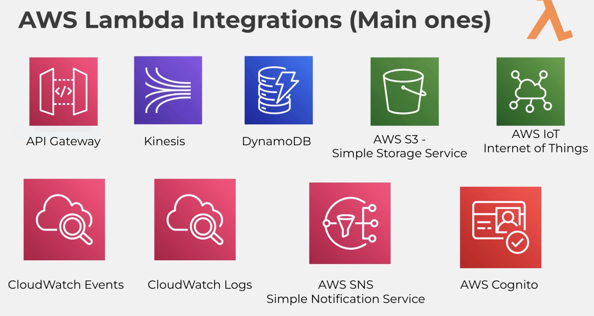
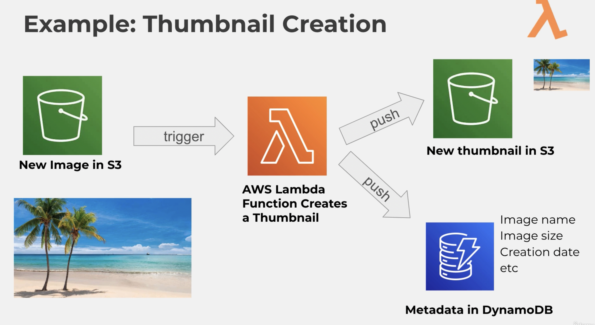

Reference: https://www.udemy.com/course/aws-lambda-serverless/

# AWS and Lambda: Key Concepts

## Overview of AWS

- **Amazon Web Services (AWS)**: A cloud provider offering on-demand cloud services.
- **On-demand Services**: Use only the resources needed, scalable as user demands increase.
- **Scalability**: Easily accommodate growth from one server to hundreds without significant overhead.
- **Revolutionized IT**: Powers major websites like Netflix, demonstrating robust, scalable infrastructure.

## AWS Lambda

- **Introduction**: Lambda functions replace traditional server management with virtual functions.
- **Cost-Efficiency**: Pay only for what is used; no charges if the functions are inactive.
- **Automatic Scaling**: Handles increased demand without manual intervention.

## Traditional Server Management vs. Lambda

- **Traditional (EC2)**: Rent virtual servers (EC2) with hourly billing regardless of actual usage.
- **Lambda**: Manage functions instead of servers; functions have short execution times, limiting costs and increasing efficiency.

## Benefits of AWS Lambda

- **Easy Pricing**: Pay-per-request and compute time.
- **Free Tier**: 1 million requests and 400,000 GB-seconds of compute time.
- **Integration**: Works seamlessly with other AWS services and multiple programming languages.
- **Monitoring**: CloudWatch enables easy monitoring of backend processes.
- **Resource Allocation**: Up to 1.5 GB of RAM, increasing computing power and network capacity.

## Supported Languages and Integrations

- **Programming Languages**: Supports Node.js, Python, Java, C#, and more.
- **AWS Services Integration**:
  - **API Gateway**: Provides a RESTful API for Lambda functions.
  - **Kinesis**: Real-time data streaming integration.
  - **DynamoDB**: NoSQL database for storing metadata.
  - **S3**: Simple storage service for large files.
  - **IoT**: Internet of Things integration.
  - **CloudWatch Events and Logs**: Scheduling and logging services.
  - **SNS**: Simple Notification Service for alerts and messages.
  - **Cognito**: User management and authorization.

## Practical Example: Image Upload and Thumbnail Creation

1. **Image Upload**: User uploads a large image to an S3 bucket.
2. **Lambda Trigger**: S3 upload triggers a Lambda function.
3. **Thumbnail Creation**: Lambda function creates a smaller version of the image.
4. **Thumbnail Storage**: Stores the thumbnail in S3.
5. **Metadata Storage**: Stores image metadata (name, size, creation date) in DynamoDB.

This demonstrates the power and efficiency of Lambda functions, which allow for automatic, scalable backend processes without the need for manual server management.
